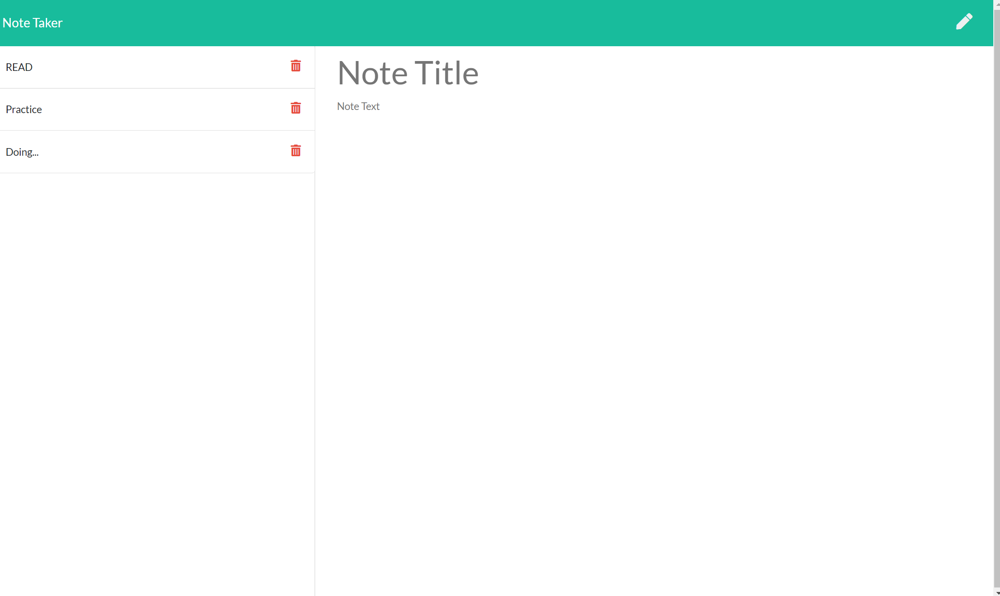

# Note-Taker

## Description

This is a note taker application that can be used to write, save, and delete notes. 

## Usage

Run npm install to install all dependencies. To use the application locally, run node server.js in your CLI, and then open http://localhost:8080 in your preferred browswer. The application running on Heroku can be found [Here](https://fast-forest-04546.herokuapp.com/)

## Built with

* [JavaScript](#js)
* [NodeJS](#nodejs)
* [Node Package: Express](#exprss)

## Questions?

For any questions you may have, feel free to find me via the information provided below:

Email:
afetyusuf.gggnc@gmail.com

[Github Page](https://github.com/HananYusuf/)
HananYusuf
